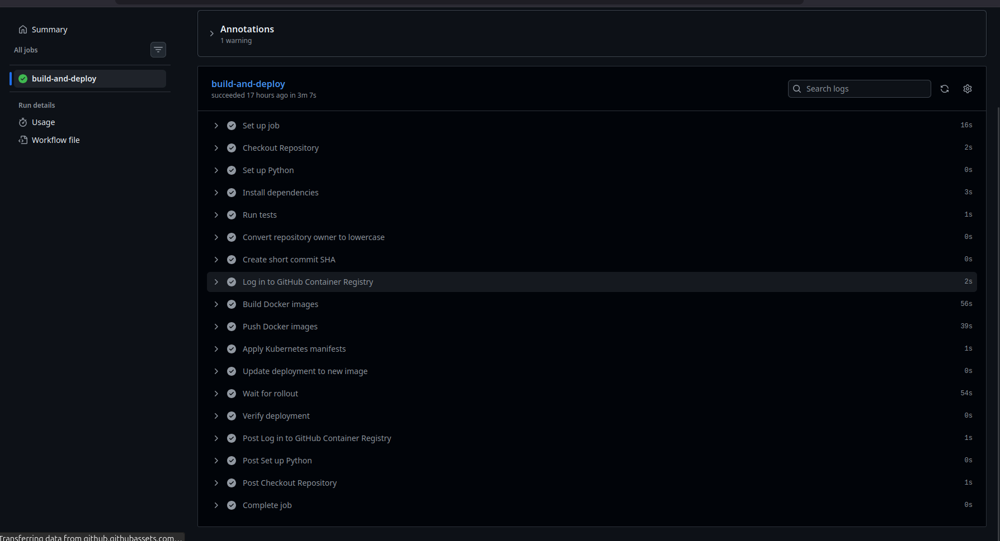
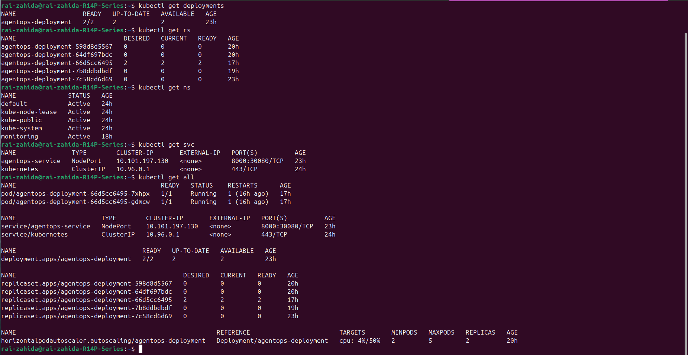
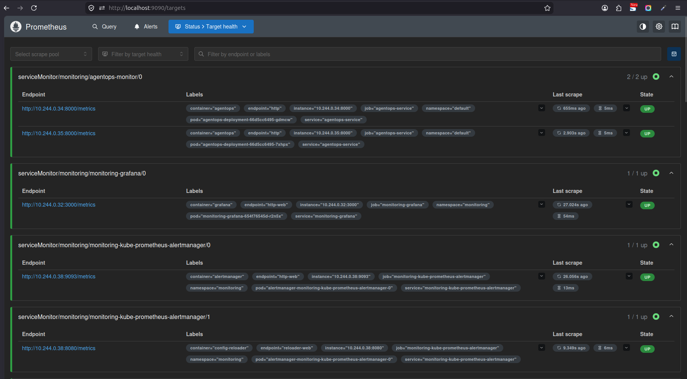
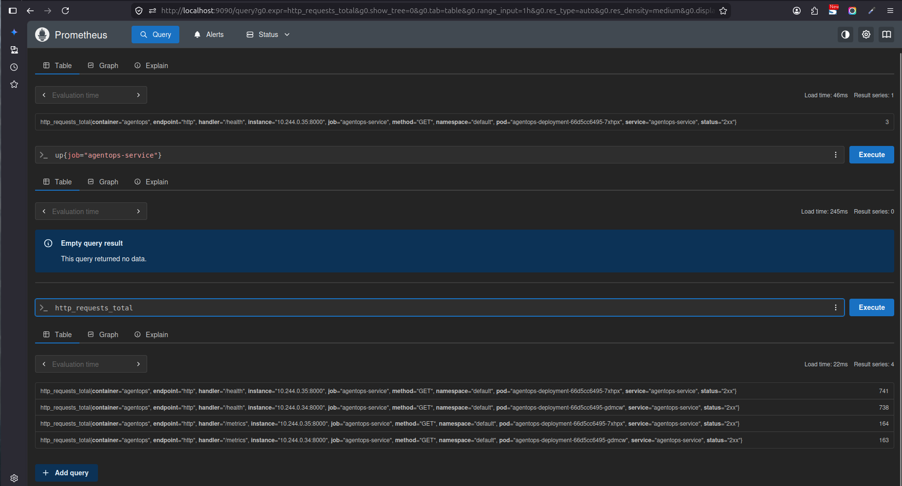
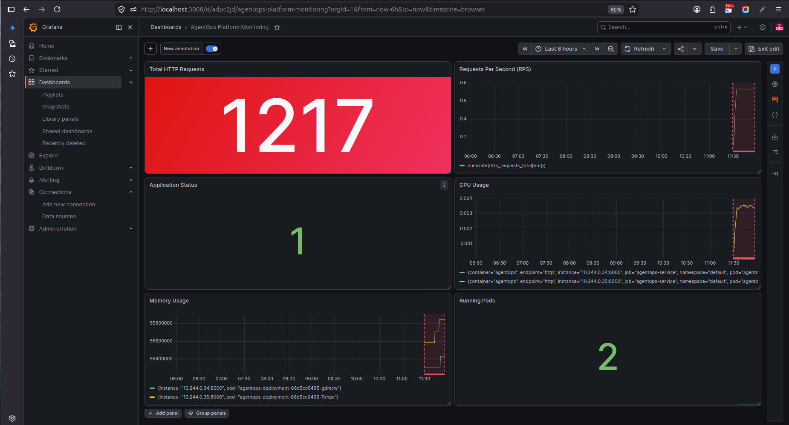

# 🚀 AgentOps Platform

A cloud-native AI-powered platform built with **FastAPI**, containerized using **Docker**, deployed on **Kubernetes**, automated with **GitHub Actions (CI/CD)**, and monitored using **Prometheus** and **Grafana**.

---

## 📖 Project Overview

AgentOps Platform demonstrates the complete lifecycle of a modern cloud-native application.

The project includes:

- REST API development using FastAPI
- Automated testing with Pytest
- Docker containerization
- Continuous Integration with GitHub Actions
- Docker image publishing to GitHub Container Registry (GHCR)
- Kubernetes deployment
- Horizontal Pod Autoscaling (HPA)
- Prometheus monitoring
- Grafana dashboards for visualization

The primary objective of this project is to gain hands-on experience with modern DevOps practices and cloud-native application deployment.

---

# 🏗️ Architecture

```text
                        Developer
                            │
                            ▼
                    GitHub Repository
                            │
                            ▼
                GitHub Actions CI Pipeline
                            │
          ┌─────────────────┼─────────────────┐
          ▼                 ▼                 ▼
     Run Tests       Build Docker Image   Push to GHCR
                            │
                            ▼
                  Kubernetes Deployment
                            │
                    ┌───────┴────────┐
                    ▼                ▼
                 AgentOps Pod     AgentOps Pod
                    │                │
                    └───────┬────────┘
                            ▼
                    Kubernetes Service
                            │
                            ▼
                  FastAPI Application
                            │
                      /metrics endpoint
                            │
                     Kubernetes Service
                            │
                     ServiceMonitor CRD
                            │
                            ▼
                      Prometheus Server
                            │
               Collects & Stores Metrics
                            │
                            ▼
                     Grafana Dashboard
```

---

# ✨ Features

- REST APIs with FastAPI
- Health Check Endpoint
- AI Chat Endpoint
- Prometheus Metrics Endpoint
- Dockerized Application
- Automated CI Pipeline
- GitHub Container Registry Integration
- Kubernetes Deployment
- Kubernetes Service
- Horizontal Pod Autoscaler (HPA)
- Prometheus Monitoring
- Grafana Dashboard
- Unit Testing with Pytest

---

# 🛠️ Tech Stack

| Category | Technology |
|----------|------------|
| Backend | FastAPI |
| Language | Python 3.11 |
| Testing | Pytest |
| Containerization | Docker |
| CI/CD | GitHub Actions |
| Container Registry | GitHub Container Registry (GHCR) |
| Orchestration | Kubernetes |
| Autoscaling | Horizontal Pod Autoscaler |
| Monitoring | Prometheus |
| Visualization | Grafana |
| Metrics Discovery | ServiceMonitor |

---

# 📂 Project Structure

```text
AgentOps-Platform/
│
├── .github/
│   └── workflows/
│       └── ci.yml
│
├── app/
│   ├── middleware/
│   ├── routes/
│   └── main.py
│
├── docker/
│
├── docs/
│   ├── images/
│   │   ├── github-actions.png
│   │   ├── grafana-dashboard.png
│   │   ├── kubernetes-pods.png
│   │   ├── prometheus-metrics.png
│   │   └── prometheus-targets.png
│   │
│   ├── architecture.md
│   └── decisions.md
│
├── evals/
├── k8s/
├── monitoring/
├── tests/
│
├── Dockerfile
├── docker-compose.yml
├── requirements.txt
├── pytest.ini
├── README.md
└── .gitignore
```

---

# ⚙️ Continuous Integration Pipeline

Every push to the repository automatically triggers GitHub Actions.

The pipeline performs the following steps:

1. Checkout Repository
2. Setup Python Environment
3. Install Dependencies
4. Execute Unit Tests
5. Build Docker Image
6. Push Docker Image to GitHub Container Registry (GHCR)

This ensures that only tested and containerized code is published.

---

# ☸️ Kubernetes Deployment

The application is deployed using Kubernetes resources:

- Deployment
- Service
- Horizontal Pod Autoscaler (HPA)
- ServiceMonitor

### Deployment

Manages application Pods and ensures high availability.

### Service

Provides a stable endpoint for communication with application Pods.

### Horizontal Pod Autoscaler

Automatically scales application Pods based on CPU utilization.

### ServiceMonitor

Allows Prometheus to automatically discover and scrape application metrics.

---

# 📊 Monitoring

The application exposes Prometheus metrics through:

```text
/metrics
```

Prometheus periodically scrapes these metrics and stores them as time-series data.

Grafana connects to Prometheus and visualizes these metrics through custom dashboards.

Dashboard Panels:

- Total HTTP Requests
- Requests Per Second (RPS)
- Application Status
- Running Pods
- CPU Usage
- Memory Usage

---

# 🧪 Running Tests

```bash
pytest
```

---

# 🐳 Docker

Build Docker Image

```bash
docker build -t agentops-platform .
```

Run Docker Container

```bash
docker run -p 8000:8000 agentops-platform
```

---

# ☸️ Deploy to Kubernetes

Deploy all Kubernetes resources

```bash
kubectl apply -f k8s/
```

Verify Pods

```bash
kubectl get pods
```

Verify Services

```bash
kubectl get svc
```

Verify HPA

```bash
kubectl get hpa
```

---

# 📸 Screenshots

## GitHub Actions Pipeline



---

## Kubernetes Deployment



---

## Prometheus Targets



---

## Prometheus Metrics



---

## Grafana Dashboard



---

# 📚 Learning Outcomes

This project provided practical experience with:

- FastAPI Development
- REST API Design
- Automated Testing
- Docker Containerization
- GitHub Actions
- Continuous Integration (CI)
- GitHub Container Registry
- Kubernetes Deployments
- Kubernetes Services
- Horizontal Pod Autoscaling
- Prometheus Monitoring
- Grafana Dashboards
- Cloud-Native Application Deployment

---

# 🚀 Future Improvements

Possible future enhancements include:

- AlertManager integration
- Kubernetes Ingress
- HTTPS with TLS certificates
- Centralized logging using Loki or EFK Stack
- Helm Charts
- Production deployment on AWS, Azure, or Google Cloud

---

# 📖 Documentation

Additional project documentation is available in the **docs** directory.

- `architecture.md` – System architecture and deployment overview
- `decisions.md` – Key architectural and implementation decisions

---

# 👨‍💻 Author

## Rai Zahida

Software Engineering Undergraduate

**GitHub**

https://github.com/RaiZahida

**LinkedIn**

https://www.linkedin.com/in/zahida-parveen-73a446347/

---

## ⭐ If you found this project interesting, consider giving it a star!